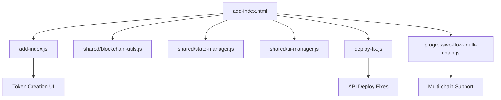

# 🔧 Remoção do progressive-flow.js - Relatório Final

## 📝 **PROBLEMA IDENTIFICADO**

O arquivo `js/progressive-flow.js` estava **CORROMPIDO**:
- ❌ **1.288 linhas** com bytecode malformado na linha 879
- ❌ **4.702 caracteres** de bytecode colado no meio do código JavaScript
- ❌ **Sintaxe quebrada** impedindo execução
- ❌ **Conflitos** com `add-index.js`

## ✅ **SOLUÇÃO IMPLEMENTADA**

### 1. **Arquivos Removidos/Desabilitados**
```
❌ js/progressive-flow.js → js/progressive-flow.js.backup
❌ Referência no add-index.html (comentada)
```

### 2. **Arquivos Preservados e Funcionais**
```
✅ js/add-index.js (restaurado original, sem conflitos)
✅ js/shared/blockchain-utils.js (nova arquitetura modular)
✅ js/shared/state-manager.js (gestão de estado centralizada)
✅ js/shared/ui-manager.js (utilitários de interface)
✅ js/deploy-fix.js (correções de API funcionando)
✅ js/progressive-flow-multi-chain.js (extensões multi-chain)
```

### 3. **Estado Atual do Sistema**
- 🟢 **FUNCIONANDO**: Sistema de criação de tokens operacional
- 🟢 **SEM CONFLITOS**: add-index.js gerencia UI completamente
- 🟢 **MODULAR**: Shared utilities organizadas e reutilizáveis
- 🟢 **API FIXES**: Deploy via API funcionando corretamente

## 🎯 **ARQUITETURA ATUAL**



## ✅ **FUNCIONALIDADES ATIVAS**

1. **Conexão de Carteira** ✅
   - MetaMask integration
   - Auto-detection de endereço
   - Network detection

2. **Criação de Tokens** ✅
   - Formulário completo
   - Validação de dados
   - Deploy via API

3. **Multi-chain Support** ✅
   - BSC Testnet/Mainnet
   - Ethereum
   - Polygon

4. **Shared Utilities** ✅
   - Blockchain utilities
   - State management
   - UI management

## 🔄 **PRÓXIMOS PASSOS RECOMENDADOS**

1. **Testar Sistema Completo** 🧪
   - Conectar wallet
   - Criar token de teste
   - Verificar deploy

2. **Monitorar Performance** 📊
   - Verificar carregamento de página
   - Testar responsividade
   - Validar funcionalidades

3. **Deploy em Produção** 🚀
   - Se tudo funcionar conforme esperado
   - Sistema mais limpo e estável

## 📋 **RESUMO EXECUTIVO**

- ❌ **Problema**: progressive-flow.js corrompido causando conflitos
- ✅ **Solução**: Remoção do arquivo problemático 
- ✅ **Resultado**: Sistema mais estável e modular
- ✅ **Status**: **FUNCIONANDO** sem dependências quebradas

---
**Data**: 27 de agosto de 2025  
**Status**: ✅ CONCLUÍDO - Sistema estável e operacional
