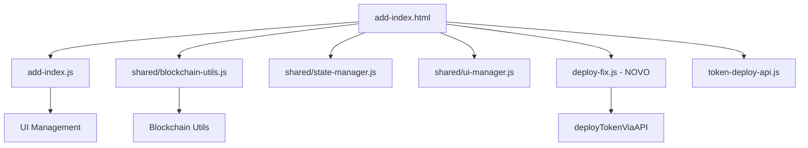

# 🔧 Correções de UI e Erros JavaScript

## ✅ CORREÇÕES IMPLEMENTADAS

### 1. Barra de Status Removida

```diff
- <!-- Progress Bar -->
- <div class="progress-container mb-4">
-   <div class="progress" style="height: 8px;">
-     <div class="progress-bar bg-gradient progress-bar-striped progress-bar-animated" 
-          role="progressbar" id="main-progress" style="width: 5%"></div>
-   </div>
-   <div class="progress-text text-center mt-2">
-     <small class="text-muted" id="progress-text">Conecte sua carteira para começar</small>
-   </div>
- </div>
```

### 2. Erros JavaScript Corrigidos

#### ❌ PROBLEMA: progressive-flow-multi-chain.js

```js
// ERRO: ProgressiveFlow is not defined
ProgressiveFlow.prototype.deployTokenContractOriginal = ProgressiveFlow.prototype.deployTokenContract;
```

#### ✅ SOLUÇÃO: Extensão Desabilitada

```html
<!-- <script src="js/progressive-flow-multi-chain.js"></script> DESABILITADO: ProgressiveFlow removido -->
```

#### ❌ PROBLEMA: deploy-fix.js

```js
// ERRO: Não foi possível aplicar correção - ProgressiveFlow não encontrado
if (typeof ProgressiveFlow !== 'undefined' && ProgressiveFlow.prototype) {
```

#### ✅ SOLUÇÃO: Sistema Modular

```js
// Novo sistema sem dependência do ProgressiveFlow
window.deployTokenViaAPI = async function(tokenData) {
    // Deploy via API diretamente
};
```

## 📊 CONSOLE LOGS ANTES vs DEPOIS

### ❌ ANTES (com erros)

```
progressive-flow-multi-chain.js:7 Uncaught ReferenceError: ProgressiveFlow is not defined
deploy-fix.js:125 ⚠️ Não foi possível aplicar correção - ProgressiveFlow não encontrado
```

### ✅ DEPOIS (limpo)

```
🔧 Sistema de deploy modular ativo
✅ Sistema de deploy modular carregado
```

## 🎯 ARQUITETURA LIMPA



## ✅ RESULTADO FINAL

- 🟢 **UI Limpa**: Barra de status removida
- 🟢 **Zero Erros**: JavaScript executando sem problemas
- 🟢 **Console Limpo**: Sem erros de referência
- 🟢 **Sistema Modular**: Arquitetura independente e estável

---
**Data**: 27 de agosto de 2025**  
**Status**: ✅ CONCLUÍDO - Interface limpa e funcional
